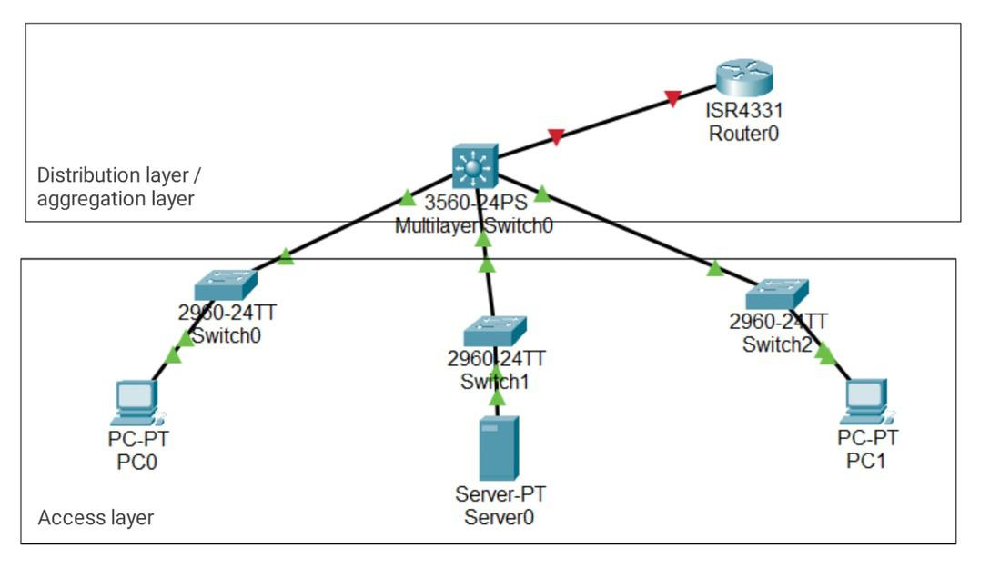
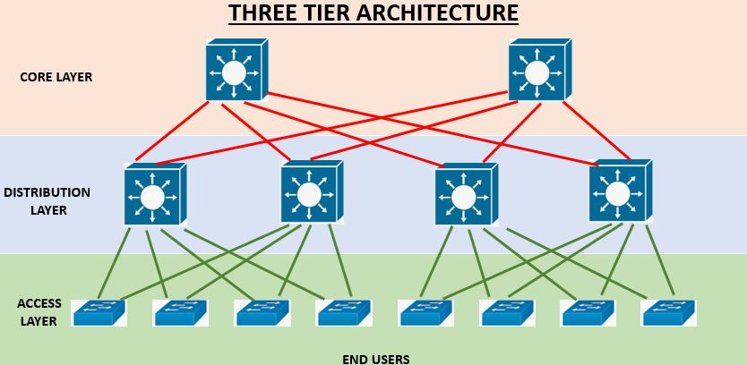
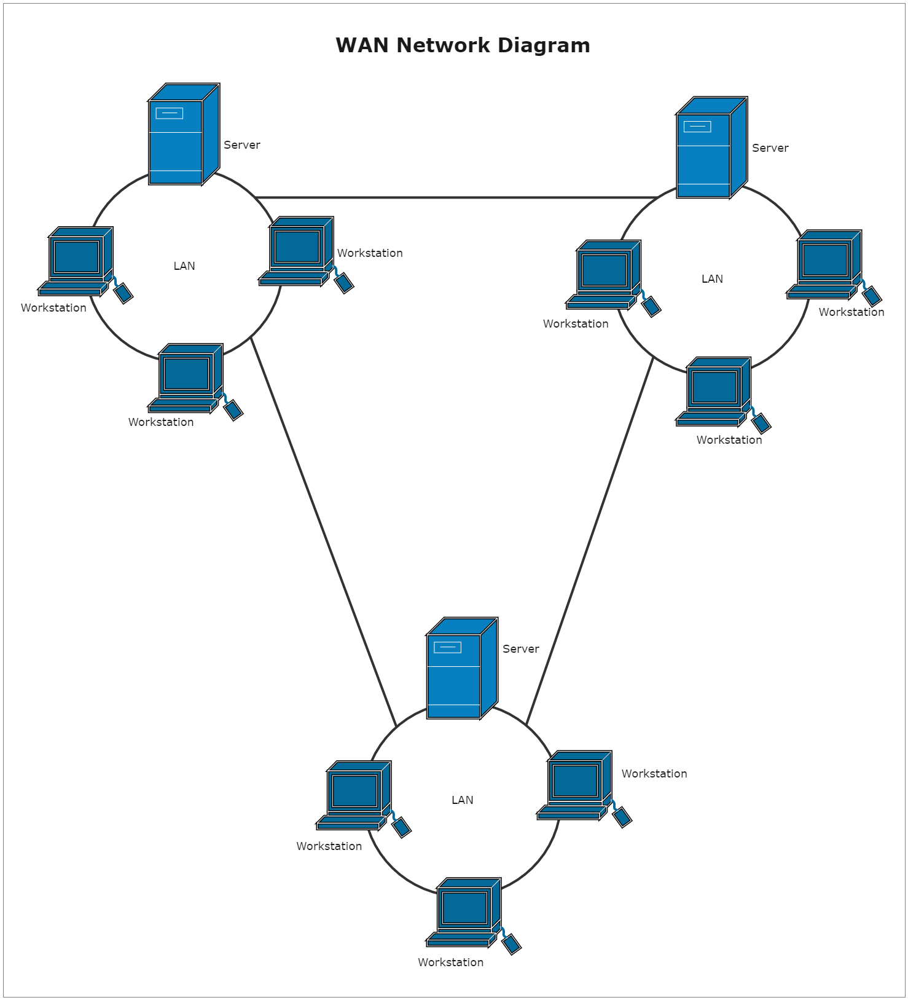
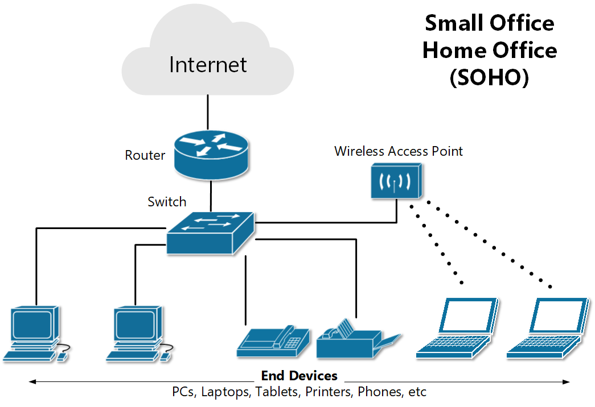
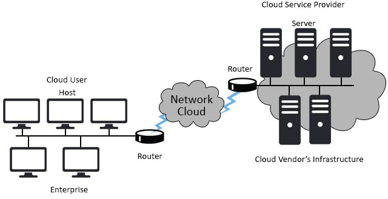

# Types of Netwrok Architecture

### 1. **2-Tier Network Architecture**

 A 2-tier architecture, also known as a collapsed core or distribution layer, combines the core and distribution layers into a single layer. This structure is commonly used in small to medium-sized networks.
 
- **Components**:
    - **Access Layer**: Connects end devices like computers, phones, and printers.
    - **Core/Distribution Layer**: Serves as the backbone of the network, handling routing and switching between access layers.
- **Advantages**: Simplicity, cost-effectiveness, and easier management.
- **Disadvantages**: Limited scalability and performance compared to more complex architectures.

### 2. **3-Tier Network Architecture**

A 3-tier architecture consists of three distinct layers: core, distribution, and access. It is designed for larger networks with higher performance and scalability requirements.

- **Components**:
    - **Core Layer**: High-speed backbone of the network, connecting distribution layers.
    - **Distribution Layer**: Acts as an intermediary between the core and access layers, implementing routing, policy, and security.
    - **Access Layer**: Connects end devices to the network.
- **Advantages**: Scalability, redundancy, and improved performance.
- **Disadvantages**: Higher complexity and cost.

### 3. **Spine-Leaf Architecture**

Spine-leaf is a data center network architecture designed for high-performance and low-latency communication.

- **Components**:
    - **Leaf Switches**: Connect to servers and storage devices.
    - **Spine Switches**: Act as the backbone, connecting all leaf switches.
- **Advantages**: Equal latency, high bandwidth, and scalability.
- **Disadvantages**: More complex to design and manage.

### 4. **Wide Area Network (WAN)**

A WAN connects multiple local area networks (LANs) over large geographical areas, often spanning cities, countries, or continents.

- **Components**: Routers, switches, and various transmission media (fiber optic, satellite, etc.).
- **Advantages**: Enables long-distance communication and resource sharing.
- **Disadvantages**: High cost and complexity, potential latency issues.

### 5. **Small Office/Home Office (SOHO) Network**

 A SOHO network is a small-scale network setup in homes or small offices, designed to provide basic networking functionalities.
 
- **Components**: Typically includes a router, switch, and various connected devices like computers and printers.
- **Advantages**: Cost-effective, easy to set up and manage.
- **Disadvantages**: Limited scalability and performance.

### 6. **On-Premise Network**

 An on-premise network refers to the traditional deployment of network infrastructure within an organization's premises.
 
- **Components**: Servers, switches, routers, storage devices, etc., all located within the organization’s facilities.
- **Advantages**: Complete control over hardware and data, enhanced security.
- **Disadvantages**: Higher upfront cost, requires in-house expertise for maintenance.

### 7. **Cloud Network**

 A cloud network is a network infrastructure that is hosted and managed by a cloud service provider.
 
- **Components**: Virtualized resources, cloud-based servers, storage, and networking components.
- **Advantages**: Scalability, flexibility, reduced upfront cost, and offloaded maintenance.
- **Disadvantages**: Dependency on the provider, potential data security concerns.

### 8. **Local Area Network (LAN)**

 A LAN is a network that connects devices within a limited area, such as a single building or campus.
 
- **Components**: Routers, switches, access points, and connected devices like computers, printers, and servers.
- **Advantages**: High speed, low latency, and easy resource sharing.
- **Disadvantages**: Limited geographical coverage, requires physical infrastructure

