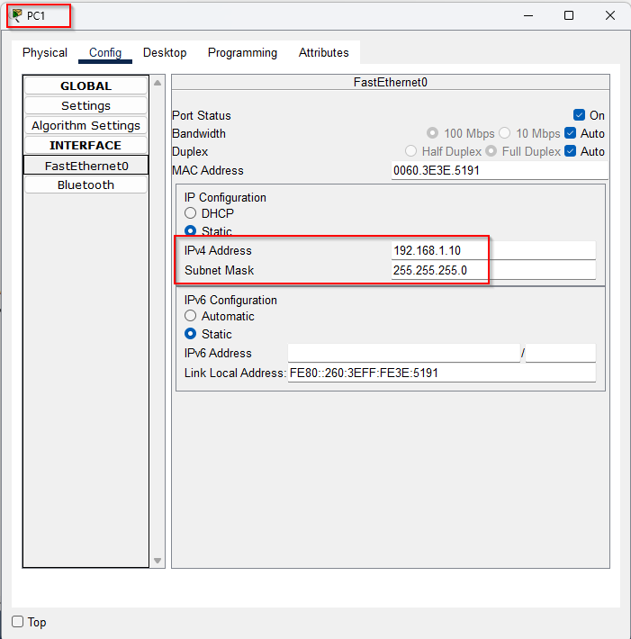
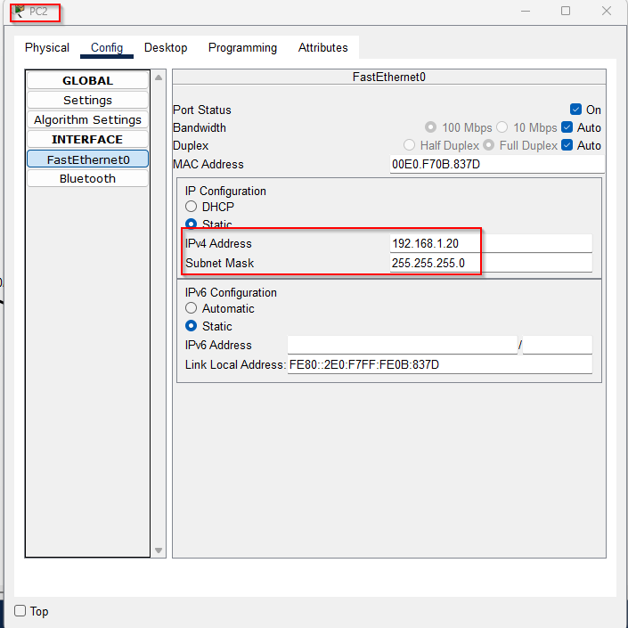
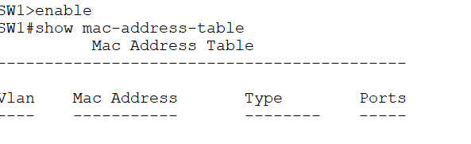
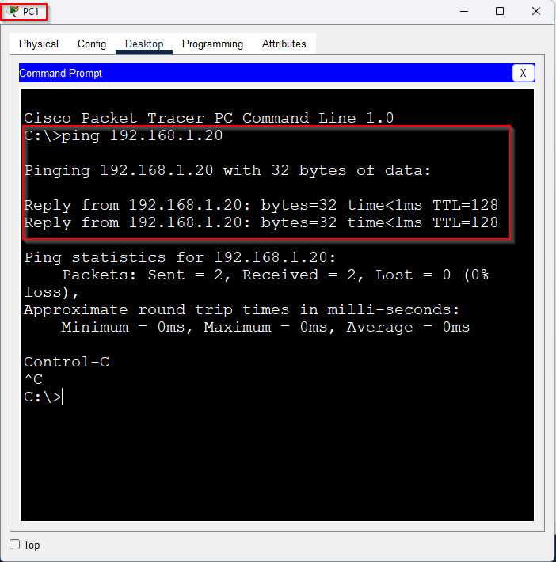
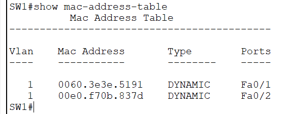

This Packet Tracer lab features two PCs with the following IP addresses: 192.168.1.10 and 192.168.1.20, both using a subnet mask of 255.255.255.0. These PCs are connected to a switch via FastEthernet interfaces 0/1 and 0/2.

***PC1***

***PC2***

A newly unboxed switch does not have any MAC addresses stored in its table. It will start learning and populating the MAC address table only when devices send traffic through it.

We can populate the MAC address table of switch **SW1** by initiating network traffic, such as pinging between **PC1** and **PC2**. When a device sends a packet, the switch learns the sender's MAC address and records it in its table.

Let's try again and there we go! The switch's MAC address table should now be populated as traffic flows between **PC1** and **PC2**.

