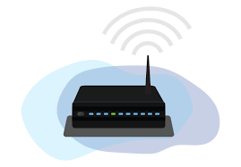

# **What is a Wireless Network?**

A wireless network is a type of computer network that uses wireless data connections between network nodes. Wireless networks are based on **radio waves** to connect devices such as laptops, smartphones, and tablets to the internet and to other networks without the need for physical cables.

### **How Does a Wireless Network Work?**

Wireless networks use **radio frequency (RF) signals** to transmit data between devices. A wireless access point (AP) acts as a central hub, transmitting and receiving signals to and from devices within its range. These signals are then converted into wired signals and sent to the broader network or the internet through a router or switch.

#### **Key Components of a Wireless Network:**

1. **Wireless Access Point (WAP)**: Acts as the central transmitter and receiver of wireless signals.
2. **Router**: Connects the wireless network to the internet, managing traffic between devices and the external network.
3. **Wireless Clients**: Devices like smartphones, laptops, and tablets that connect to the network wirelessly.
4. **Network Interface Card (NIC)**: Installed in devices to enable wireless communication.

### **Types of Wireless Networks**

1. **Wireless Local Area Network (WLAN)**:
    
    - Connects devices in a limited area, such as a home, school, or office.
    - Most common type is Wi-Fi.
2. **Wireless Metropolitan Area Network (WMAN)**:
    
    - Covers a larger geographic area than WLAN, such as a city.
    - Example: WiMAX.
3. **Wireless Wide Area Network (WWAN)**:
    
    - Covers large areas, such as regions or countries.
    - Uses cellular network technologies like 4G and 5G.
4. **Wireless Personal Area Network (WPAN)**:
    
    - Connects devices within a very short range, typically within a single room.
    - Examples include Bluetooth and ZigBee.