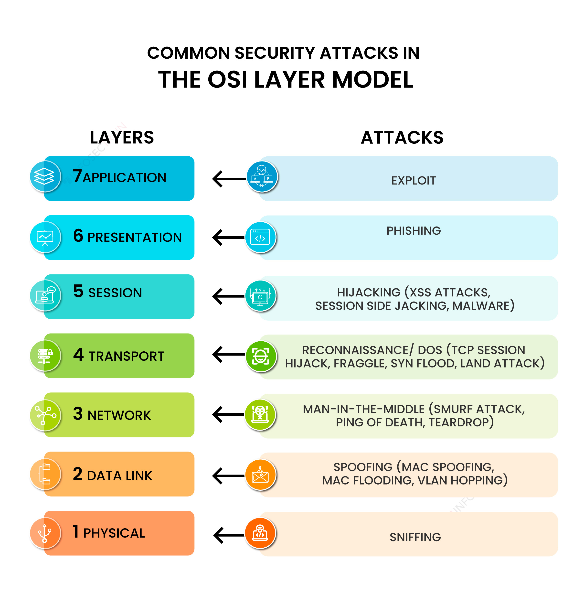
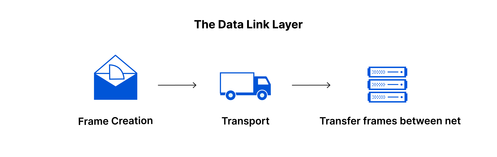
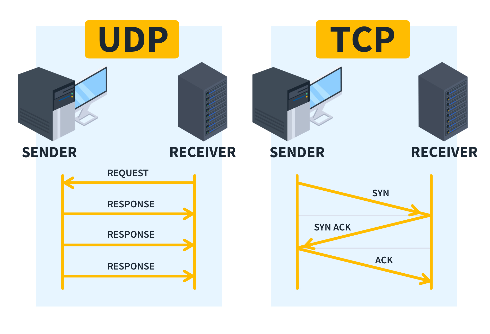
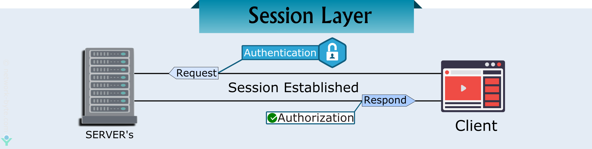
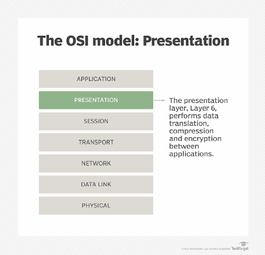

# What is OSI Model?

The ****OSI (Open Systems Interconnection)**** Model is a set of rules that explains how different computer systems communicate over a network. OSI Model was developed by the International Organization for Standardization (ISO)**. The OSI Model consists of 7 layers and each layer has specific functions and responsibilities. This layered approach makes it easier for different devices and technologies to work together. OSI Model provides a clear structure for data transmission and managing network issues.

### 1. **Physical Layer**

- **Function**: This layer is concerned with the physical connection between devices and the transmission of the raw bit stream (0s and 1s) over a physical medium. It defines the hardware equipment, cabling, wiring, frequencies, and pulses used to represent binary signals. It also specifies the physical properties of the devices and media, such as voltages, pin layout, timing, and data rates.
- **Components**: Cables (Ethernet, coaxial, fiber optic), switches (hubs), repeaters, and network interface cards (NICs).
- **Example**: When you connect your computer to a network using an Ethernet cable, the Physical layer is responsible for transmitting the electrical signals that represent the binary data.

### 2. **Data Link Layer**

- **Function**: This layer is responsible for node-to-node data transfer between devices on the same network. It organizes bits into frames and manages access to the physical medium. It also performs error detection and correction (but not necessarily error correction). The Data Link layer has two sublayers: the MAC (Media Access Control) sublayer and the LLC (Logical Link Control) sublayer.
- **Components**: Switches, bridges, MAC addresses, and Ethernet.
- **Example**: A switch uses the MAC address of your computer to ensure that the data packet is sent to the correct device within a local network.

### 3. **Network Layer**

- **Function**: This layer handles the routing of data across different networks. It is responsible for logical addressing (IP addressing), path determination, and packet forwarding. It decides how data is sent to the receiving device based on IP addresses.
- **Components**: Routers, IP addresses (IPv4, IPv6), and routing protocols (e.g., OSPF, BGP).
- **Example**: When you access a website, the Network layer determines the best route for the data packets to travel across the internet using IP addresses.

### 4. **Transport Layer**

- **Function**: This layer ensures reliable data transfer between devices. It manages error detection, correction, and data flow control. It also handles segmentation and reassembly of data, ensuring that large messages are broken into smaller segments for transmission and reassembled at the destination.
- **Components**: Protocols like TCP (Transmission Control Protocol) for reliable communication and UDP (User Datagram Protocol) for faster, connectionless communication.
- **Example**: When you download a file, the Transport layer ensures that all parts of the file are received correctly and in order.

### 5. **Session Layer**

- **Function**: The Session layer manages sessions or connections between applications. It establishes, maintains, and terminates connections, ensuring that the communication between two devices remains synchronized and organized.
- **Components**: APIs, sockets, and session protocols.
- **Example**: During a video call, the Session layer maintains the session between your device and the other participant's device, ensuring that the call continues smoothly.

### 6. **Presentation Layer**

- **Function**: This layer translates the data from the format used by the application layer into a common format at the sending device, and vice versa at the receiving device. It handles data encryption, compression, and formatting. This layer ensures that the data is in a readable format for the Application layer.
- **Components**: Data conversion utilities, encryption/decryption services.
- **Example**: When you access a secure website (HTTPS), the Presentation layer uses SSL/TLS to encrypt the data, ensuring that it cannot be easily intercepted and read by unauthorized parties.

### 7. **Application Layer**

- **Function**: The topmost layer of the OSI model, it provides network services directly to the end-users or applications. It supports application services such as email, file transfer, and web browsing. It is also responsible for identifying communication partners, determining resource availability, and synchronizing communication.
- **Components**: Application protocols like HTTP, FTP, SMTP, and DNS.
- **Example**: When you use a web browser to visit a website, the Application layer (using the HTTP protocol) handles the request and response between your browser and the web server.

### Real-time Example: **Web Browsing**

1. **Physical Layer**: Your computer sends signals through the Ethernet cable to the router.
2. **Data Link Layer**: The router uses the MAC address to send the data frame to your ISP.
3. **Network Layer**: The ISP assigns your device an IP address and routes the data packet through the internet.
4. **Transport Layer**: TCP ensures the data is received correctly and in the right order.
5. **Session Layer**: Maintains the session between your browser and the web server.
6. **Presentation Layer**: SSL/TLS encrypts the data for secure transmission.
7. **Application Layer**: The web browser requests and displays the website to the user