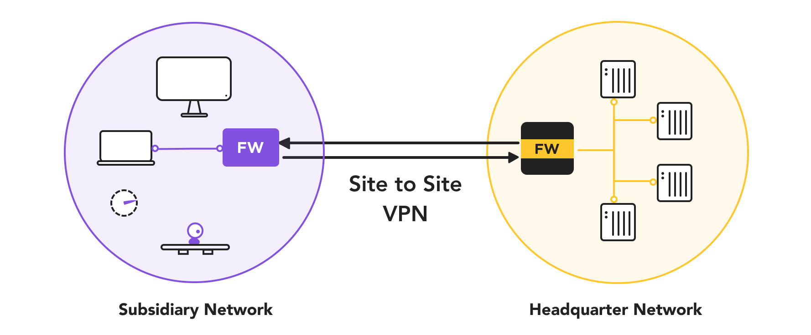
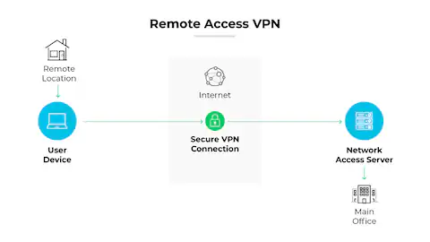

# What is a VPN?

A **VPN (Virtual Private Network)** is a secure way to create a private network over a public network, such as the internet. It allows users or systems to securely send and receive data as if their devices were directly connected to a private network. VPNs achieve this by encrypting the data being transmitted, ensuring confidentiality, integrity, and authenticity.

---

### **Types of VPN**

1. **Site-to-Site VPN**:
    
    - **Definition**: A site-to-site VPN connects two or more networks, such as branch offices and a headquarters, over the internet.
    - **Use Case**: Commonly used by businesses to securely connect geographically separated offices, enabling them to share resources as if on the same local network.
    - **How It Works**:
        - The VPN devices (usually routers or firewalls) at each site establish a secure, encrypted tunnel between the sites.
        - Traffic between the sites is encrypted before being sent and decrypted upon receipt.
    - **Example**: Connecting the network of an office in New York with one in London.

2. **Remote-Access VPN (Client-to-Site VPN)**:
    
    - **Definition**: A remote-access VPN allows individual users (clients) to securely connect to a private network from any location.
    - **Use Case**: Commonly used by employees working remotely to securely access their organization’s resources, such as internal systems, files, or applications.
    - **How It Works**:
        - The client connects to a VPN server, typically using VPN software.
        - The connection establishes an encrypted tunnel, allowing the client to access the private network as if they were on-site.
    - **Example**: An employee using a laptop to securely connect to their company’s network from home.

3. Split Tunneling
	- Normally, with a VPN, **all traffic** is routed through the encrypted tunnel to the VPN server (this is called **full tunneling**). This ensures all communications are protected but can sometimes cause slower performance.
	- **Split tunneling**, on the other hand, allows users to Route sensitive traffic (e.g., accessing company resources) through the secure VPN.
    - Route non-sensitive traffic (e.g., streaming videos, personal browsing) directly to the internet, bypassing the VPN.

---

### **Cryptography in VPNs**

Cryptography is essential to VPNs as it ensures secure communication over potentially insecure networks.

1. **Encryption**: Protects the confidentiality of the data.
    
    - Common algorithms: AES (Advanced Encryption Standard), 3DES (Triple Data Encryption Standard).
2. **Authentication**: Verifies the identity of the sender and receiver.
    
    - Common methods: Digital certificates, pre-shared keys, or username/password combinations.
3. **Hashing**: Ensures data integrity by verifying that data hasn’t been altered during transmission.
    
    - Common algorithms: SHA (Secure Hash Algorithm), MD5 (Message Digest 5).
4. **Key Exchange**: Establishes a secure session by sharing encryption keys between parties.
    
    - Common protocols: Diffie-Hellman, RSA.

---

### **IPSec Protocol**

**IPSec (Internet Protocol Security)** is one of the most widely used protocols for implementing VPNs. It operates at the network layer and provides security features such as:

1. **Confidentiality**: By encrypting the data using algorithms like AES or 3DES.
2. **Integrity**: Ensures data has not been tampered with using HMAC (Hash-Based Message Authentication Code).
3. **Authentication**: Verifies the identities of the communicating parties using digital certificates or pre-shared keys.
4. **Anti-Replay Protection**: Prevents attackers from intercepting and replaying VPN packets.

#### **IPSec Modes**

- **Transport Mode**: Only encrypts the payload of the IP packet, leaving the header intact. Commonly used for end-to-end communication between two hosts.
- **Tunnel Mode**: Encrypts the entire IP packet (header and payload), encapsulating it in a new IP packet. Used for site-to-site VPNs.

#### **IPSec Protocols**

- **AH (Authentication Header)**: Provides authentication and integrity but no encryption.
- **ESP (Encapsulating Security Payload)**: Provides encryption, authentication, and integrity.

#### **IPSec Key Exchange**

- **IKE (Internet Key Exchange)**: Facilitates the negotiation of security associations (SAs), encryption algorithms, and key exchange between VPN endpoints.
    - IKE operates in two phases:
        - **Phase 1**: Establishes a secure, authenticated channel (IKE SA).
        - **Phase 2**: Negotiates SAs for data encryption (IPSec SA).